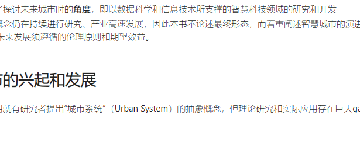

> 20231007
# 智慧城市的内涵和范畴

全球规模的城市化、通信计算机技术的普及应用👉带来两个并发现象：“城市数字化”、“互联网社会化”。
2010年至今，我国和其他国家的政府、研究机构、企业对“智慧城市”的内涵进行不同的解释，均体现“智慧城市”理念的两个层面：
1. 对包括大数据、云计算、人工智能、物联网在内的新信息技术的合理开发与应用
2. 对当前城市问题及未来美好城市人居诉求的回应
本书对“智慧城市”内涵与范畴的定义：
1. 城市界定了讨论概念的**范围**，即城市普遍的特征、地理和行政的范围
2. “智慧”界定了探讨未来城市时的**角度**，即以数据科学和信息技术所支撑的智慧科技领域的研究和开发
3. “智慧城市”概念仍在持续进行研究、产业高速发展，因此本书不论述最终形态，而着重阐述智慧城市的演进、基本构造、场景应用、未来发展须遵循的伦理原则和期望效益。

# 智慧城市的兴起和发展

早在19世纪中期就有研究者提出“城市系统”（Urban System）的抽象概念，但理论研究和实际应用存在巨大gap。

