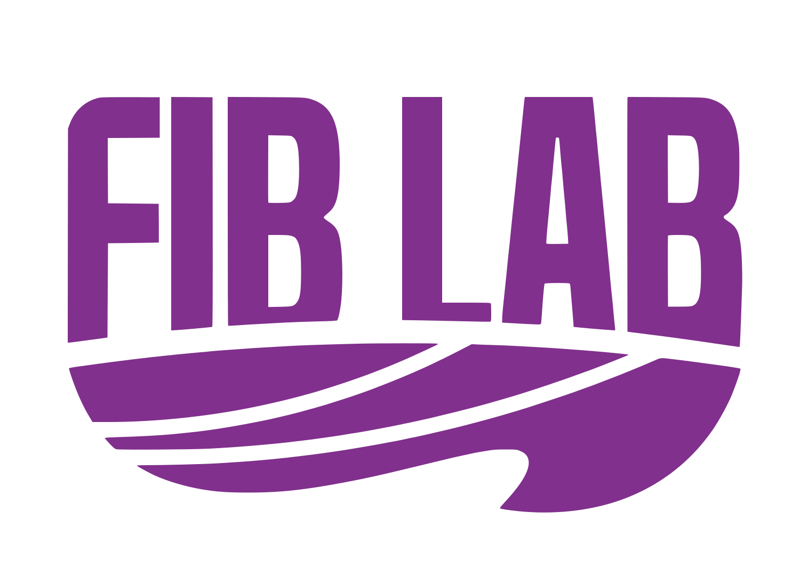

<!-- 导航栏手机适配 -->
<!-- publication，projects做成单独页面 -->
<!-- 加show more按钮 -->
<!-- 字体 标题突出-->
<!-- 摄影、山地民宿、红莲小学、万里学院等设计项目 notion页面-->

# 👋🦁 About Me

Hi there! I am an incoming 2025 Fall Ph.D. (Environmenal Studies) student at [UC Berkeley](https://www.berkeley.edu/)  with [Dr. Lu Liang](https://sites.google.com/site/liang3mlab/people/prof-lu-liang) in the [Geospatial 3M Lab](https://sites.google.com/site/liang3mlab/home). I received my M.Arch from [Tsinghua University](https://www.tsinghua.edu.cn/en/) in 2025 and B.Eng (Architecture) from [Tongji University](https://caup.tongji.edu.cn/caupen/main.htm) with the highest distinction in 2023.

I mainly use **GIS, Remote Sensing, and Geospatial AI** to understand **human-environment interaction** from global to urban scale to support planning and design for **well-being and sustainable cities**. To study this topic, I utilize large-scale and high-resolution **urban sensing** data and techniques such as LiDAR, streetview, GPS, and social media...

### Research Interests:

- **Environmental Sustainability:** Heat, Air Pollution, Flooding...
- **Human Well-being:** Micro-Mobility, Human Perception, Urban Renewal, Public Health...
- **Geospatial AI:** LLM, Spatial Intelligence, Deep Learning...
  

## 🔥 News



## 📖 Selected Publications

Please see [Google Scholar](https://scholar.google.com/citations?user=wrPOVnkAAAAJ) for full publication list. 
†Equal Contribution, *Corresponding Author



## 🎓 Education

  

  <strong>2025 - Present</strong> 
   
  
  

  

  <strong><a href="https://www.berkeley.edu/" style="color: #002676">University of California, Berkeley</a></strong> 
  Doctor of Philosophy (Environmental Studies) 
  Department of Landscape Archi. & Environmental Planning (<a href="https://ced.berkeley.edu/land">Link</a>) 
  Advisor: <a href="https://sites.google.com/site/liang3mlab/people/prof-lu-liang">Dr. Lu Liang</a>
  

  

  <strong>2023 - 2025</strong> 
   
  
  

  

  <strong><a href="https://www.tsinghua.edu.cn/en/" style="color: #002676">Tsinghua University</a></strong> 
  Master of Architecture (Urban Informatics and Urban Renewal) 
  School of Architecure (<a href="https://www.arch.tsinghua.edu.cn/column/Home">Link</a>) 
  GPA: 3.93 / 4 
  Comprehensive Excellence Scholarship 
  Advisor: <a href="https://www.arch.tsinghua.edu.cn/info/FArchitecture/1864">Dr. Jinxi Chen</a>
  

  

  <strong>2019 - 2023</strong> 
   
  
  

  

  <strong><a href="https://www.tongji.edu.cn/eng/" style="color: #002676">Tongji University</a></strong> 
  Bachelor of Engineering (Architecture and Urban Design) 
  College of Architecture and Urban Planning (<a href="https://caup.tongji.edu.cn/caupen/main.htm">Link</a>) 
  GPA: 4.89 / 5 (Top 1%) 
  Distinct Graduate of Shanghai (Top 0.1%, Highest Distinction); National Scholarship 
  Minor Degree in Finance @ <strong><a href="https://www.fudan.edu.cn/en/">Fudan University</a></strong>
  

## 🏙️ Affiliation

  

  <strong>2024.09 - Present</strong> 
  
  

  

  <strong><a href="https://fi.ee.tsinghua.edu.cn/" style="color: #002676">Future Intelligence LaB (FIB-Lab), Tsinghua University</a></strong> 
  Research Assistant 
  Department of Electronic Engineering (<a href="https://fi.ee.tsinghua.edu.cn/">Link</a>) 
  Advisor: <a href="https://fi.ee.tsinghua.edu.cn/~gaochen/">Dr. Chen Gao</a>, <a href="https://vonfeng.github.io/">Dr. Jie Feng</a>, <a href="https://fi.ee.tsinghua.edu.cn/~liyong/">Dr. Yong Li</a>
  

  

  <strong>2024.10 - 2025.03</strong> 
  
  

  

  <strong><a href="https://www.thad.com.cn/" style="color: #002676">Tsinghua Architectural Design & Research Institute</a></strong> 
  Intern Planner & Architect 
  <i>Zhejiang Wanli University Yuyao Campus Project</i><!-- 引用到项目页面 详情可以notion做 -->
  

  

  <strong>2023.08 - 2024.06</strong> 
  

  
  

  

  <strong><a href="http://www.thupdi.com/" style="color: #002676">Tsinghua Tongheng Urban Planning Institute</a></strong> 
  Intern Architect 
  <i>Beijing 1st Experimental Primary School Honglian Branch Renewal Project</i><!-- 引用到项目页面 详情可以notion做 -->
  

  

  <strong>2021.12 - 2022.02</strong> 
  

  
  

  

  <strong><a href="https://www.kysec.cn/" style="color: #002676">Kaiyuan Securities Research Institute</a></strong> 
  Intern Equity Researcher 
  <i>In-depth Report on the cosmetics industry and BeiTaiNi (SZ.300957) (<a href="https://www.fxbaogao.com/detail/3015179">Link</a>)</i><!-- 引用到项目页面 详情可以notion做 -->
  

<!-- 更多按钮 begins -->

<!-- 更多按钮 ends -->

## 🎉 Activities & Services

### Conference

- **[2025]** [Accepted] The 65th Association of Collegiate Schools of Planning Annual Conference ([ACSP](https://www.acsp.org/)), Minneapolis, US.
- **[2025]** [Accepted] The 4rd International Conference on Urban Informatics ([GSCS & ICUI](https://www.isocui.org/)), Hong Kong, China.
- **[2025]** [Poster Presentation] The 19th International Conference on Computational Urban Planning and Urban Management ([CUPUM](https://cupum.co/)), London, UK.
- **[2025]** [Oral Presentation] The 19th International Association for China Planning Annual Conference ([IACP](https://www.china-planning.org/)), Xiamen, China.
- **[2025]** [Oral Presentation] The 32nd International Conference on Geoinformatics ([CPGIS](https://www.cpgis.org/)), Jiaozuo, China.
- **[2025]** [Accepted] Extending Knowledge-based View in Generative AI Era. The 85th Annual Meeting of the Academy of Management ([AOM](https://aom.org/)), Copenhagen, Denmark.
- **[2025]** [Accepted] Architecting Knowledge Ecosystems: How Generative AI Redraws the Boundaries of Competitive Advantage. Strategic Management Society 45th Annual Conference ([SMS](https://www.strategicmanagement.net/)), San Francisco, US.
- **[2025]** [Accepted] The 25th COTA International Conference of Transportation Professionals ([CICTP](https://cictp2025.scievent.com/)), Guangzhou, China.
- **[2024]** [Poster Presentation] [Nature Conference on Air Pollution and Climate Change](https://web.cvent.com/event/06e7aeed-3b2e-4a19-982f-ce28d2a97924/summary), Beijing, China.

### Academic Services

**Peer Reviewer:** 
- **[Journal]** GIScience & Remote Sensing; Building and Environment; Computational Urban Science; Architectural Engineering and Design Management
- **[Conference]** ICLR 2025 EmbodiedAI Workshop

### Organization

- **[2022.01-Present]** Student member of the **Architectural Society of China**.
- **[2023.12-Present]** Volunteer in **Citipedia** (the #1 volunteer group in promoting sustainable city and transportation in China.
- **[2022.09-2024.08]** Committee member of the **Student Branch, Architectural Society of China**.
- **[2021.10-2022.11]** Leader of the Students' Union of College of Architecture and Urban Planning, Tongji University.
- **[2021.07-2022.08]** Leader of the "Dream Classroom" voluntary teaching & design & construction project (Tibet Lhatse Middle School and Xinjiang Huocheng Middle School), Tongji University.

### Teaching

- **[Tsinghua University] Undergraduate Dissertation Design Studio:** 2023 Fall, 2024 Spring, 2024 Fall, 2025 Spring (TA).
- **[Tsinghua University] Urban Design Elements:** 2023 Fall (TA).

## 🏆 Selected Awards

### Honors & Scholarships

- **[2024]** **Comprehensive Excellence Scholarship**: Awarded by Tsinghua University.
- **[2023]** **Distinct Graduate of Shanghai**: Graduation with the highest distinction (Top 0.1%).
- **[2022]** **The First Prize Undergraduate Scholarship**: Awarded by Tongji University.
- **[2021]** **The First Prize Undergraduate Scholarship**: Awarded by Tongji University.
- **[2021]** **Outstanding Student Model**: Top 7 of 4300+ undergraduates at Tongji University.
- **[2020]** **National Scholarship**: Highest honor for undergraduate (Top 1%).

### Competitions

- **[2022]** **Exhibition of Architectural Design in Developing Countries**: Bronze Award.
- **[2021]** **National Real Estate Innovation & Entrepreneurship Competition**: Top Prize.
- **[2021]** **National Computer Design Competition for College Students**: Second Prize.
- **[2020]** **National English Competition for College Students**: Top Prize.

## 🪪 Certificates & Skills

- **Language:** English (GRE 336, CET-6 684); Japanese (N5); Chinese (Native)
- To be updated
<!-- 考日语N1，考CFA I -->

## 🎾 Misc

- I love the 90s Alternative Rock, Britpop, Citypop, and Classicals. My favorite contemporary artists include: Blur, Big Thief, Radiohead, 万能青年旅店, The Velvet Underground, Pink Floyd, My Little Airport, Cheer Chen...
- I watch about 200+ movies each year. Sometimes I write something. We can talk on [Douban](https://www.douban.com/people/xycf/)! My favorite directors are Quentin Tarantino, Woody Allen, Alfred Hitchcock, David Fincher, Christoph Nolan... My life movie is "The Lord of The Rings", "Yi Yi" by Edward Yang, and "The Secret Life of Walter Mitty". My favorite TV is "ロングバケーション"(Long Vacation).
- I enjoy "city walking" and photography. You can find my portfolio on [500px](https://500px.com.cn/ruaruaxu).
- I've been passionate about tennis since 20. I was a member of the Tsinghua School of Architecture Tennis Team. I've been learning piano since 22 (hope I can play La Fille aux Cheveux de Lin and Liebesträume one day!).🎾🎹
- I am a "No spicy, no joy" person, and my "spiritual hometown" is Sichuan.😈
- My nickname is ruarua or rua.😁

## 📫 Contact

I am always excited to meet fellow researchers with shared interests! 
Please feel free to contact me via Email or WeChat.

- **Email:** wenruixu(at)outlook(dot)com
- **WeChat:** ruaruaxu
<!--- **Blog:** urbanxlab (WeChat Public Account) -->
<!---

-->

